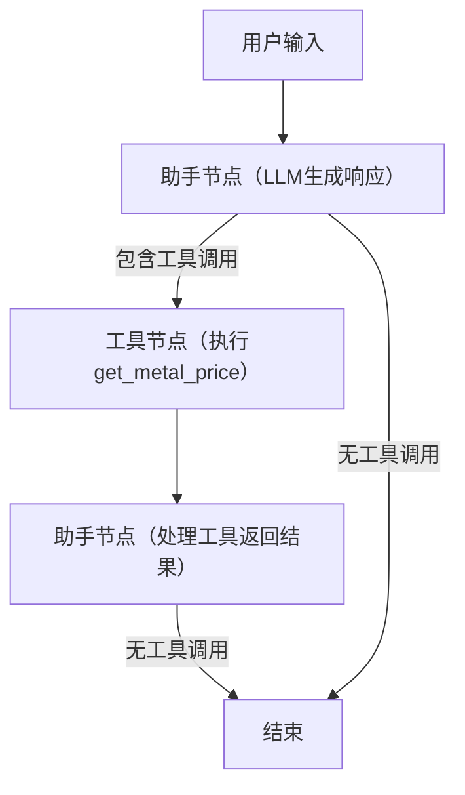

### 详细总结：基于LangGraph与Ragas构建和评估金属价格查询的ReAct代理

#### 一、网页核心定位与技术栈

**主题**：通过LangGraph构建ReAct代理工作流，结合Ragas评估框架验证代理在工具调用和目标达成上的性能。
**技术栈**：LangGraph（流程编排）、LangChain（工具集成）、Ragas（评估指标）、OpenAI LLM（gpt-4o-mini）。
**核心价值**：展示如何通过工具调用扩展LLM能力，并系统化评估代理的任务执行效果。

#### 二、完整技术流程与代码实现

##### **1. 先决条件与环境配置**

###### 1.1 环境要求

- **Python版本**：3.8+
- **基础认知**：熟悉LangChain工具机制、LangGraph状态图构建、Ragas评估逻辑。

###### 1.2 依赖安装

```python
# 安装LangGraph（指定版本0.2.44）、Ragas及NLTK
%pip install langgraph==0.2.44
%pip install ragas
%pip install nltk
```

##### **2. 构建ReAct代理核心组件**

###### 2.1 模拟API响应或初始化真实API

- **方案1：使用预定义JSON模拟金属价格数据**

  ```python
  metal_price = {
      "gold": 88.1553, "silver": 1.0523, "platinum": 32.169,
      "palladium": 35.8252, "copper": 0.0098, "aluminum": 0.0026,
      # 完整JSON包含更多金属价格（如lbma_gold_am、mcx_silver等，共28个键值对）
  }
  ```
- **方案2：注册metals.dev获取真实API Key（需联网请求）**
  （代码略，网页建议通过模拟数据快速启动）

###### 2.2 定义工具函数（LangChain工具装饰器）

```python
from langchain_core.tools import tool

@tool
def get_metal_price(metal_name: str) -> float:
    """获取指定金属的当前价格（美元/克）"""
    metal_name = metal_name.lower().strip()
    if metal_name not in metal_price:
        raise KeyError(f"金属'{metal_name}'未找到，可用金属：{', '.join(metal_price.keys())}")
    return metal_price[metal_name]
```

- **关键点**：工具接收 `metal_name`参数，返回价格数值，支持异常处理（如金属不存在时抛出错误）。

###### 2.3 绑定工具到LLM（ChatOpenAI模型）

```python
from langchain_openai import ChatOpenAI

tools = [get_metal_price]  # 工具列表
llm = ChatOpenAI(model="gpt-4o-mini")  # 初始化LLM
llm_with_tools = llm.bind_tools(tools)  # 将工具绑定到LLM，允许模型调用工具
```

###### 2.4 定义对话状态与流程控制

- **状态类（GraphState）**：跟踪对话消息历史

  ```python
  from langgraph.graph import END
  from langchain_core.messages import AnyMessage
  from langgraph.graph.message import add_messages
  from typing import Annotated
  from typing_extensions import TypedDict

  class GraphState(TypedDict):
      messages: Annotated[list[AnyMessage], add_messages]  # 存储HumanMessage/AIMessage/ToolMessage
  ```
- **流程控制函数（should_continue）**：判断是否继续工具调用

  ```python
  def should_continue(state: GraphState):
      last_message = state["messages"][-1]
      return "tools" if last_message.tool_calls else END  # 有工具调用则继续，否则结束
  ```

###### 2.5 定义节点与构建状态图（StateGraph）

- **助手节点（生成LLM响应）**

  ```python
  def assistant(state: GraphState):
      response = llm_with_tools.invoke(state["messages"])
      return {"messages": [response]}  # 返回包含新消息的状态
  ```
- **工具节点（管理工具执行）**

  ```python
  from langgraph.prebuilt import ToolNode
  tool_node = ToolNode(tools)  # 初始化工具节点，传入get_metal_price工具
  ```
- **构建完整状态图**

  ```python
  from langgraph.graph import START, StateGraph
  from IPython.display import Image, display

  builder = StateGraph(GraphState)  # 基于GraphState构建图

  # 添加节点
  builder.add_node("assistant", assistant)
  builder.add_node("tools", tool_node)

  # 定义边（流程走向）
  builder.add_edge(START, "assistant")  # 起始于助手节点
  builder.add_conditional_edges("assistant", should_continue, ["tools", END])  # 助手节点根据条件转向工具节点或结束
  builder.add_edge("tools", "assistant")  # 工具调用后回到助手节点处理结果

  react_graph = builder.compile()  # 编译状态图
  display(Image(react_graph.get_graph(xray=True).draw_mermaid_png()))  # 可视化图结构（生成流程图）
  ```

##### **3. 代理执行与消息格式转换**

###### 3.1 运行代理并获取对话历史

```python
from langchain_core.messages import HumanMessage

# 示例查询：铜价
messages = [HumanMessage(content="What is the price of copper?")]
result = react_graph.invoke({"messages": messages})  # 执行状态图

# 输出对话历史（包含HumanMessage、AIMessage、ToolMessage）
print(result["messages"])
```

###### 3.2 转换为Ragas评估格式

```python
from ragas.integrations.langgraph import convert_to_ragas_messages

ragas_trace = convert_to_ragas_messages(result["messages"])  # 转换为Ragas消息列表
# 输出格式：包含type（human/ai/tool）、content、tool_calls的结构化数据
```

- **转换后示例**：
  ```python
  [
      HumanMessage(type='human', content='What is the price of copper?'),
      AIMessage(type='ai', content='', tool_calls=[ToolCall(name='get_metal_price', args={'metal_name': 'copper'})]),
      ToolMessage(type='tool', content='0.0098'),
      AIMessage(type='ai', content='The price of copper is $0.0098 per gram.')
  ]
  ```

##### **4. 代理性能评估（Ragas指标）**

###### 4.1 工具调用准确性（Tool Call Accuracy）

- **目标**：验证LLM是否正确调用工具及参数
- **代码实现**：
  ```python
  from ragas.metrics import ToolCallAccuracy
  from ragas.dataset_schema import MultiTurnSample
  from ragas.messages import ToolCall

  # 创建评估样本（指定预期工具调用）
  sample = MultiTurnSample(
      user_input=ragas_trace,  # 转换后的Ragas消息列表
      reference_tool_calls=[ToolCall(name="get_metal_price", args={"metal_name": "copper"})]
  )

  # 计算得分（1.0表示完全正确）
  tool_accuracy_scorer = ToolCallAccuracy()
  score = await tool_accuracy_scorer.multi_turn_ascore(sample)
  print(f"Tool Call Accuracy: {score}")  # 输出：1.0
  ```

###### 4.2 代理目标准确性（Agent Goal Accuracy）

- **目标**：验证代理是否达成用户最终目标（如计算10克银价）
- **代码实现**（以复杂查询为例）：
  ```python
  from ragas.metrics import AgentGoalAccuracyWithReference
  from ragas.llms import LangchainLLMWrapper

  # 新查询：10克银价
  messages = [HumanMessage(content="What is the price of 10 grams of silver?")]
  result = react_graph.invoke({"messages": messages})
  ragas_trace = convert_to_ragas_messages(result["messages"])

  # 创建样本（指定目标描述）
  sample = MultiTurnSample(
      user_input=ragas_trace,
      reference="Price of 10 grams of silver"  # 预期目标
  )

  # 初始化评估LLM并计算得分
  evaluator_llm = LangchainLLMWrapper(ChatOpenAI(model="gpt-4o-mini"))
  scorer = AgentGoalAccuracyWithReference()
  scorer.llm = evaluator_llm
  score = await scorer.multi_turn_ascore(sample)
  print(f"Agent Goal Accuracy: {score}")  # 输出：1.0（目标达成）
  ```

##### **5. 完整代码逻辑图示**



#### 三、关键技术细节解析

1. **ReAct代理核心机制**：

   - **推理-行动循环**：LLM先决定是否调用工具（推理），再通过工具节点执行操作（行动），重复直至无需工具调用。
   - **状态传递**：`GraphState`通过 `messages`列表存储完整对话历史，确保节点间信息共享（如工具返回值传递给LLM生成最终响应）。
2. **Ragas评估优势**：

   - **多轮对话支持**：`MultiTurnSample`适配复杂对话流程，支持逐轮验证工具调用和目标达成。
   - **指标灵活性**：除内置指标外，支持自定义评估逻辑（如 `ToolCallAccuracy`可扩展参数校验规则）。
3. **LangGraph核心价值**：

   - **可视化流程编排**：通过 `StateGraph`构建器直观定义节点连接，降低复杂代理的开发难度。
   - **条件控制**：`should_continue`函数实现动态流程决策，避免硬编码状态转移逻辑。

#### 四、代码扩展与最佳实践

1. **真实API集成**：修改 `get_metal_price`函数，使用 `requests`库调用metals.dev真实API（需处理身份验证和错误重试）：

   ```python
   import requests
   API_KEY = "your_api_key"
   def get_metal_price(metal_name: str) -> float:
       url = f"https://metals.dev/api/{metal_name}/price"
       headers = {"Authorization": f"Bearer {API_KEY}"}
       response = requests.get(url, headers=headers)
       response.raise_for_status()
       return response.json()["price"]
   ```
2. **异常处理增强**：在工具函数中添加更细致的错误处理（如网络错误、API返回格式异常），提升代理鲁棒性。
3. **多工具扩展**：
   添加更多工具（如 `get_metal_trend`分析价格趋势），并在状态图中增加对应节点和流程控制。

#### 五、总结

本教程完整演示了从代理构建到评估的全流程：

1. **LangGraph**负责定义对话流程和工具调用逻辑，通过状态图实现可视化编排；
2. **Ragas**提供专业评估指标，确保代理在工具使用和用户目标上的准确性；
3. **代码细节**覆盖了从环境配置到复杂指标计算的每个环节，可直接复用于其他工具调用场景（如天气查询、电商导购）。

通过这种集成，开发者能高效构建可解释、可验证的AI代理，尤其适合需要外部数据交互的业务场景（金融、客服、实时数据查询等）。
